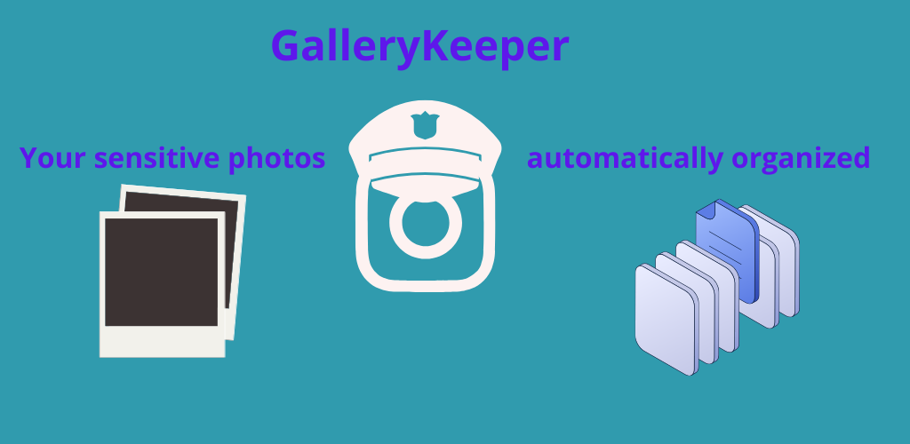
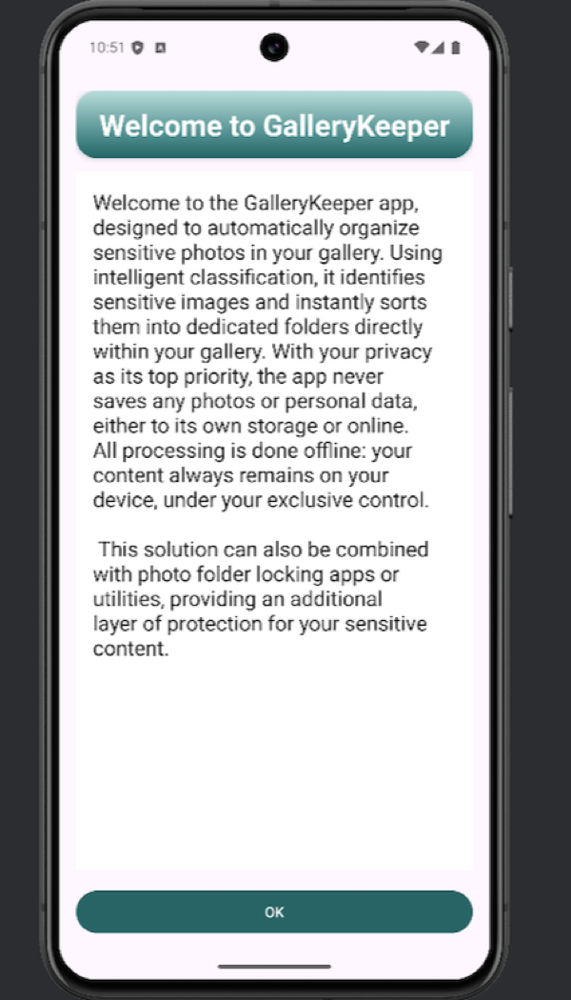
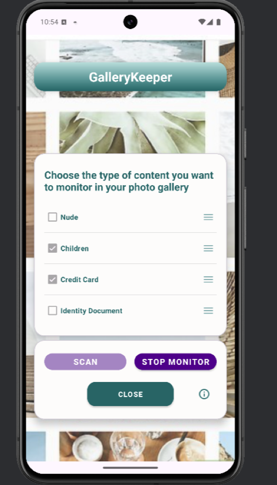

#  GalleryKeeper-App

<!-- Illustration (scaled down for a more harmonious layout) -->

  

## Your gallery, simpler. Cleaner. Better organized.

**GalleryKeeper** is an Android app designed to **detect, classify, and organize sensitive (“delicate”) photos** in your gallery.

It’s built to manage that kind of content (e.g., ID documents, credit cards, etc.) — **not to organize every single everyday photo**.

Whether it’s screenshots, documents received from messaging apps, or photos you consider sensitive and want to sort properly, GalleryKeeper helps you take control of those images — with minimal effort.

---

## What is it for?

With GalleryKeeper, you can:

- **Automatically detect** when new photos appear in your gallery.
- **Monitor and classify “delicate” photos** using artificial intelligence.
- **Organize your images** by moving them into the right folders (based on rules you choose).
- **Keep your gallery clean** by suggesting deletions (duplicates / unnecessary images) *after confirmation*.
- **Enable monitoring mode** so the app can keep working even when you leave it (via an Android notification).

> Important: when Android requires confirmation (for example, to delete a photo), **GalleryKeeper always asks for your approval**.

---

## Delicate photos: AI-based classification

GalleryKeeper focuses on **detecting and organizing sensitive/delicate photos**. Depending on your configuration, the app can identify 4 main categories:

- **Nudity photos**
- **Children photos**
- **ID documents** (identity cards, passports, etc.)
- **Credit card photos**

To do this, GalleryKeeper uses an **AI model** based on **YOLO11**, **adapted for the app’s needs** (object/visual cue detection associated with these categories).

---

## How does it work (simple overview)?

1. You enable **monitoring**.
2. When a new photo appears, GalleryKeeper processes it.
3. The app applies your rules (e.g., move to a folder).
4. If a sensitive action is required (e.g., deletion), Android shows a system prompt:
    - you accept → the action is performed
    - you refuse → nothing is deleted

---

## Privacy & offline operation

- GalleryKeeper works **offline**: **no internet connection is required** to analyze/classify your photos.
- **No photo is ever saved** by the application:
    - **not in the app’s private storage space**,
    - **and not in the cloud**.
- GalleryKeeper processes media **on your device** through Android APIs (MediaStore).
- When a modification/deletion requires authorization, **Android** displays the confirmation screen.
- You stay in control: **no deletion happens “silently”** if Android requires your approval.

---

## What you will see on Android

To work properly, Android may show:

- A **notification** while monitoring is active (required for background services).
- Permission requests (photos access, notifications, etc.).
- Confirmation screens to modify/delete some photos (depending on the Android version).

---

## FAQ

### Does GalleryKeeper delete photos automatically?

No. When Android requires a confirmation, **you must approve it**. Without your consent, nothing is deleted.

### Does the app work when I close it?

Yes, if **monitoring** is enabled. Android keeps a service running with a notification.

### Why do I see a “monitoring active” notification?

This is an Android rule: any app doing continuous background work must show a notification.

---

## Summary

**GalleryKeeper** is your assistant to:

- monitor new photos,
- detect and classify delicate photos with AI,
- organize automatically,
- keep your gallery clean while **always** staying in control.

## Technologies used
- Android Studio
- Java
- XML
- Yolo11

## Demo

- minimum sdk version : 24
- target sdk version : 35

- **Test APK (debug build)**:  [GalleryKeeper.apk](https://www.dropbox.com/scl/fi/z4ow92ynle7y8fyw560c7/GalleryKeeper.apk?rlkey=5gl19047zt2jc4537tjz9vdo3&st=ii7fajii&dl=0)

- **Demo #1 — in English**: https://www.youtube.com/watch?v=jnUaWvC-wpw
- **Demo #2 — in French**: https://www.youtube.com/watch?v=V_BQd_TGrLw

## ScreenShots

<table>
  <tr>
    <td>
      
    </td>
    <td>
      
    </td>
  </tr>
</table>
